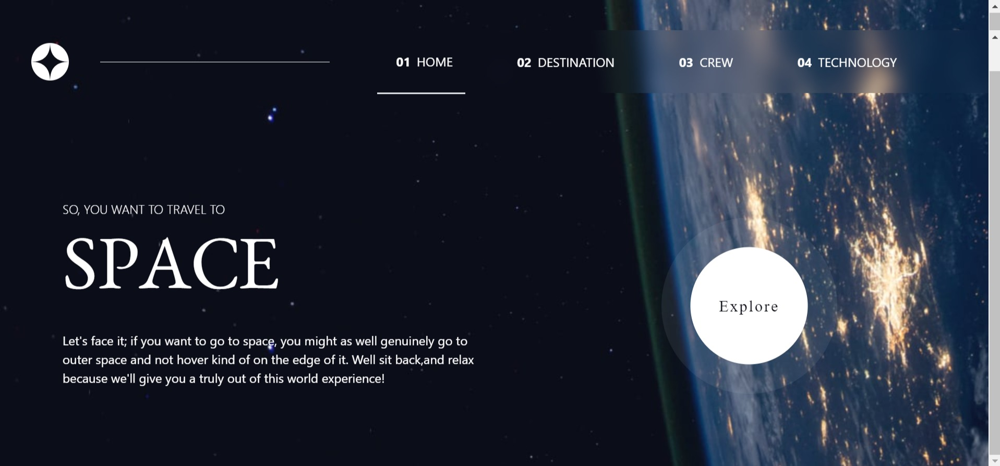

# Frontend Mentor - Space tourism website solution

This is a solution to the [Space tourism website challenge on Frontend Mentor](https://www.frontendmentor.io/challenges/space-tourism-multipage-website-gRWj1URZ3). Frontend Mentor challenges help you improve your coding skills by building realistic projects. 

## Table of contents

- [Overview](#overview)
  - [The challenge](#the-challenge)
  - [Screenshot](#screenshot)
  - [Links](#links)
- [My process](#my-process)
  - [Built with](#built-with)
  - [What I learned](#what-i-learned)
  - [Continued development](#continued-development)
  - [Useful resources](#useful-resources)
- [Author](#author)
- [Acknowledgments](#acknowledgments)

**Note: Delete this note and update the table of contents based on what sections you keep.**

## Overview

### The challenge

Users should be able to:

- View the optimal layout for each of the website's pages depending on their device's screen size
- See hover states for all interactive elements on the page
- View each page and be able to toggle between the tabs to see new information

### Screenshot




### Links

- Solution URL: [Add solution URL here](https://your-solution-url.com)
- Live Site URL: [View my live Site](https://space-tourism-website-matt.vercel.app/)

## My process

### Built with

- Semantic HTML5 markup
- CSS custom properties
- Flexbox
- Mobile-first workflow
- [React](https://reactjs.org/) - JS library
- [Next.js](https://nextjs.org/) - React framework
- [Styled Components](https://styled-components.com/) - For styles

**Note: These are just examples. Delete this note and replace the list above with your own choices**

### What I learned

I have learnt how to effectively use React Router to navigate through the website pages(routes).I have also learnt how to use and customize  react tabs while using data.json file to populate the website from the destination,crew and technology data objects.

To see how you can add code snippets, see below:

```Array.map
{Array.isArray(data) && data.map((item, index) => (
    <Tab key={index}
        className="crew-btn"
        onClick={() => setValue(index)}
        style={{
        backgroundColor: index === value ? "white" : "#979797",
        }}
    >
    
</Tab>
))}
```
```tailwindCSS especially the backdrop-blur
export default function NavLinks() {
    return (
        <div className="nav-items bg-transparent backdrop-blur-md w-2/3 px-10">
            <ul className=" hidden md:flex lg:flex justify-around items-center uppercase  h-20 pr-10">
                <li className=" border-b-2 hover:border-b-2 py-7 px-4"><a href={`/`}><span className=" font-bold px-2">01</span>home</a></li>
                <li className="hover:border-b-2 py-7 px-4"><a href={`/destination`}><span className=" font-bold px-2">02</span>destination</a></li>
                <li className="hover:border-b-2 py-7 px-4"><a href={`/crew`}><span className=" font-bold px-2">03</span>crew</a></li>
                <li className="hover:border-b-2 py-7 px-4"><a href={`/technology`}><span className=" font-bold px-2">04</span>technology</a></li>
            </ul>
        </div>
    )
}
```
```
Using the react Router
const router = createBrowserRouter([
  {
    path: "/",
    element: <App />,
    errorElement: <ErrorPage />,
    // Nesting other routes inside the app route(Root Route)
    children: [
      {
        path: "/",
        element:<Hero />

      },
      {
      path: "/destination",
        element: <Destination />
      },
      {
        path: "/crew",
        element:<Crew />
      },
      {
        path: "/technology",
        element:<Technology />
      }
    ]    
  },
  
])
```


### Continued development

Use this section to outline areas that you want to continue focusing on in future projects. These could be concepts you're still not completely comfortable with or techniques you found useful that you want to refine and perfect.


### Useful resources

- [Example resource 1](https://www.example.com) - This helped me for XYZ reason. I really liked this pattern and will use it going forward.
- [Example resource 2](https://www.example.com) - This is an amazing article which helped me finally understand XYZ. I'd recommend it to anyone still learning this concept.

**Note: Delete this note and replace the list above with resources that helped you during the challenge. These could come in handy for anyone viewing your solution or for yourself when you look back on this project in the future.**

## Author

- Website - [Add your name here](https://www.your-site.com)
- Frontend Mentor - [@yourusername](https://www.frontendmentor.io/profile/yourusername)
- Twitter - [@yourusername](https://www.twitter.com/yourusername)

**Note: Delete this note and add/remove/edit lines above based on what links you'd like to share.**

## Acknowledgments

This is where you can give a hat tip to anyone who helped you out on this project. Perhaps you worked in a team or got some inspiration from someone else's solution. This is the perfect place to give them some credit.

**Note: Delete this note and edit this section's content as necessary. If you completed this challenge by yourself, feel free to delete this section entirely.**
